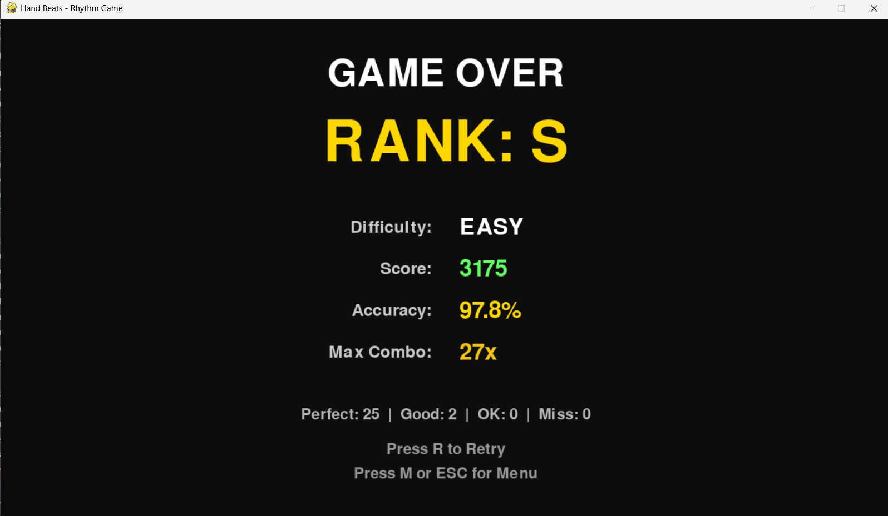

# HandBeats: Gesture Rhythm Game
Tugas Besar Sistem / Teknologi Multimedia - IF25-40305


## Deskripsi Project
HandBeats adalah game interaktif berbasis kamera yang menampilkan bounding box instrumen musik seperti "Kick", "Snare", dan "Hi-Hat" di layar. Pemain harus mengetuk area tersebut menggunakan gesture tangan tepat waktu mengikuti irama musik. Sistem mendeteksi pergerakan tangan dengan MediaPipe Hands, dan jika posisi serta timing sesuai, maka akan muncul suara beat, efek visual, serta peningkatan skor.

## Anggota Kelompok
- Ferdana Al-Hakim (122140012)

## Screenshots

### Main Menu

*Menu utama dengan pilihan difficulty level (Easy, Medium, Hard)*

### Gameplay

*In-game screenshot menunjukkan hand tracking dan falling objects*

### Result Screen

*Layar hasil dengan skor, akurasi, dan statistik permainan*

### System Flowchart

*Alur sistem HandBeats dari mulai hingga selesai* 

## Komponen Multimedia

### 1. IMAGE PROCESSING
- **MediaPipe Hands**: Deteksi dan tracking tangan real-time
- **Bounding Box Detection**: Kalkulasi posisi tangan dalam koordinat layar
- **Collision Detection**: Deteksi overlap antara tangan dan target zone
- **Hand Landmark Visualization**: Overlay skeleton tangan pada video

### 2. VIDEO PROCESSING
- **Real-time Camera Capture**: OpenCV untuk capture video dari webcam
- **Frame Processing**: Konversi BGR to RGB, flipping, resizing
- **Video Overlay**: Composite video feed dengan game graphics
- **Visual Effects**: Glow effects, particle effects, screen shake

### 3. AUDIO PROCESSING
- **Seamless Music Looping**: Loop musik utama 9 detik tanpa jeda
- **Sound Effects**: Instrument sounds (kick, snare, hi-hat)
- **Audio Synchronization**: Sinkronisasi falling objects dengan beat
- **Layered Audio**: Polyphonic playback untuk multiple sounds

## Fitur Game

### Difficulty Levels
- **EASY**: Slower falling speed, simple patterns, forgiving timing
- **MEDIUM**: Moderate speed, smart drum patterns, balanced timing
- **HARD**: Fast speed, complex patterns, tight timing windows

### Scoring System
- **PERFECT**: ±60-100ms timing window (100 points)
- **GOOD**: ±100-180ms timing window (50 points)
- **OK**: ±180-280ms timing window (25 points)
- **MISS**: Outside timing window (0 points)
- **Combo Multiplier**: 10x = 1.2x, 20x = 1.5x, 30x = 2.0x, 50x = 2.5x

### Pattern System
- **Simple Pattern**: K-S-H-S repeating (Easy)
- **Smart Pattern**: Drum-like rhythm dengan variasi (Medium)
- **Complex Pattern**: Advanced drum fills dan syncopation (Hard)

## Struktur Project

```
handbeats-rhythm-game/
├── main.py                  # Entry point
├── requirements.txt         # Dependencies
├── README.md
│
├── config/                  # Game configuration
│   ├── constants.py         # Colors, zones, paths
│   ├── settings.py          # Difficulty settings
│   └── beatmap.py           # Pattern generator
│
├── src/                     # Core game logic
│   ├── game_manager.py      # Main orchestrator
│   ├── audio_manager.py     # Audio processing
│   ├── hand_tracker.py      # Image processing
│   ├── lane.py              # Target zones
│   ├── falling_object.py    # Rhythm notes
│   ├── collision.py         # Hit detection
│   └── score_manager.py     # Scoring system
│
├── ui/                      # User interface
│   ├── menu_screen.py       # Main menu
│   ├── game_screen.py       # Game UI with video overlay
│   └── result_screen.py     # Result stats
│
├── assets/                  # Media files
│   ├── audio/
│   │   ├── main.mp3         # Main beat (9s loop)
│   │   ├── kick.wav
│   │   ├── snare-drum-341273.mp3
│   │   └── open-hi-hat-431740.mp3
│   └── image/
│       ├── kick.png
│       ├── snare.PNG
│       ├── hi-hat.PNG
│       └── menu.png
│
├── screenshots/             # Game screenshots
│   ├── menu.png
│   ├── gameplay.png
│   ├── result.png
│   └── flowchart.png
│
└── report/                  # Documentation
    ├── handbeats_report.tex
    ├── handbeats_report.pdf
    └── Referensi.bib
```

## Installation

1. Install dependencies:
```bash
pip install -r requirements.txt
```

2. Ensure camera is connected and working

3. Run the game:
```bash
python main.py
```

## Controls

### Menu
- **UP/DOWN Arrow**: Select difficulty
- **ENTER/SPACE**: Start game

### In-Game
- **Hands**: Position hands over target zones to hit notes
- **ESC**: Return to menu

### Result Screen
- **R**: Retry with same difficulty
- **M/ESC**: Return to main menu

## Technical Details

### Image Processing
- MediaPipe Hands detection with 0.7 confidence threshold
- Bounding box calculation from 21 hand landmarks
- Real-time coordinate transformation (camera → screen space)
- Collision detection using rectangle intersection

### Video Processing
- 1280x720 HD camera capture (720p)
- High-quality LANCZOS4 interpolation for scaling
- BGR→RGB color space conversion
- MJPG compression for better quality
- Surface rotation and alpha blending
- Real-time overlay rendering at 60 FPS

### Audio Processing
- 44.1kHz audio sampling rate
- Infinite loop with pygame.mixer.music.play(-1)
- Multi-channel sound effects playback
- Beat-synchronized object spawning

## Performance

- **Target FPS**: 60 FPS
- **Hand Detection**: ~30ms per frame
- **Total Latency**: <50ms (detection + rendering)
- **Audio Latency**: <10ms

## Development Logbook

| Tanggal | Kegiatan | Hasil / Progress Pekerjaan |
|---------|----------|----------------------------|
| 28/10/2024 | Brainstorming & Konsep | • Menentukan tema rhythm game berbasis gesture<br>• Menentukan judul project "HandBeats"<br>• Merancang konsep dasar gameplay dengan falling objects dan hand tracking<br>• Memilih teknologi: MediaPipe, OpenCV, Pygame |
| 05/11/2024 | Setup Repository | • Inisialisasi repository di GitHub<br>• Membuat struktur folder project<br>• Membuat README.md awal<br>• Menentukan dependencies yang diperlukan |
| 14/11/2024 | Implementasi Inti | **Sistem Hand Tracking:**<br>• Implementasi MediaPipe Hands untuk deteksi tangan<br>• Setup camera capture menggunakan OpenCV<br>• Integrasi hand landmarks dengan koordinat layar<br>• Testing akurasi tracking<br><br>**Fondasi Game:**<br>• Membuat class HandTracker untuk image processing<br>• Membuat class RhythmGame untuk rendering<br>• Implementasi game loop dasar<br>• Setup pygame display dan event handling |
| 23/11/2024 | Koleksi Asset | • Upload audio assets: kick, snare, hi-hat sounds<br>• Upload main beat music (9-second loop)<br>• Membuat icon instrumen (kick.png, snare.PNG, hi-hat.PNG)<br>• Organisasi assets ke dalam folder terstruktur |
| 28/11/2024 | Implementasi Game Lengkap | **Sistem Inti:**<br>• Audio Manager: seamless music looping dan SFX playback<br>• Lane System: target zones untuk setiap instrumen<br>• Falling Objects: note generation dengan timing<br>• Collision Detection: rectangle intersection dan timing windows<br>• Score Manager: scoring system dengan combo multiplier<br><br>**Fitur Gameplay:**<br>• Pattern generator untuk beatmap (simple, smart, complex)<br>• Difficulty levels: Easy, Medium, Hard<br>• Timing accuracy: PERFECT, GOOD, OK, MISS<br>• Visual effects: glow, hit flash, lane activation<br><br>**Testing:**<br>• Kalibrasi timing windows<br>• Performance testing (target 60 FPS)<br>• Verifikasi audio sync |
| 07/12/2024 | Peningkatan UI | **Sistem Menu:**<br>• Implementasi MenuScreen dengan pilihan difficulty<br>• Desain UI dengan background image<br>• Navigasi arrow key (UP/DOWN)<br>• Transisi yang smooth<br><br>**Result Screen:**<br>• Statistik lengkap: Score, Accuracy, Max Combo<br>• Sistem ranking (S, A, B, C, D)<br>• Breakdown per kategori (Perfect, Good, OK, Miss)<br>• Opsi retry dan kembali ke menu<br><br>**Polish Visual:**<br>• Text shadows untuk keterbacaan<br>• Semi-transparent overlays<br>• Indikator difficulty berwarna<br>• Peningkatan kontras pada background |
| 10/12/2024 | Refactoring & Dokumentasi | **Kualitas Kode:**<br>• Menghapus emoji characters dari console output<br>• Standardisasi format print: [OK], [WARNING], [ERROR]<br>• Cleanup imports dan unused code<br>• Peningkatan code readability<br><br>**Dokumentasi:**<br>• Membuat flowchart sistem (draw.io)<br>• Membuat laporan LaTeX lengkap<br>• Update README.md dengan screenshots<br>• Dokumentasi komponen multimedia<br><br>**Testing Final:**<br>• Cross-platform testing<br>• Pengecekan kompatibilitas camera<br>• Pengukuran audio latency<br>• Performance benchmark |
| 12/12/2024 | Finalisasi & Submission | **Penyempurnaan UI/UX:**<br>• Perbaikan keterbacaan teks menu dengan text shadows<br>• Peningkatan visibility opsi yang tidak dipilih (background opacity)<br>• Enhanced visual contrast untuk semua screens<br><br>**Finalisasi Dokumentasi:**<br>• Compile laporan LaTeX final (10 halaman)<br>• Menambahkan link GitHub repository ke dokumentasi<br>• Membuat folder screenshots dengan 4 gambar (menu, gameplay, result, flowchart)<br>• Update README.md dengan Development Logbook lengkap<br>• Menambahkan referensi dan credits<br><br>**Quality Assurance:**<br>• Review kode final<br>• Verifikasi kelengkapan assets<br>• Testing game secara menyeluruh<br>• Persiapan material submission<br><br>**Project Complete:** ✅ |

### Key Milestones
- ✅ **Week 1-2**: Concept & Planning
- ✅ **Week 3**: Repository Setup & Initial Research
- ✅ **Week 4**: Core Hand Tracking Implementation
- ✅ **Week 5**: Asset Integration
- ✅ **Week 6**: Complete Game Mechanics
- ✅ **Week 7**: UI/UX Enhancement
- ✅ **Week 8**: Polish & Documentation

## Demo Video

Video presentasi dan gameplay demo HandBeats:

🎥 **[Link Demo Video](https://drive.google.com/drive/folders/1yi_bBCLpoROTS0yNwP34aYQUylI4HONZ?usp=drive_link)**


## Repository

Source code lengkap project ini tersedia di GitHub:

🔗 **https://github.com/luciferdana/handbeats-rhythm-game**

## Referensi
- **Inspirasi Gameplay**: https://vt.tiktok.com/ZSydyTok3/
- **MediaPipe Documentation**: https://developers.google.com/mediapipe
- **Pygame Documentation**: https://www.pygame.org/docs/
- **Sound Effects**: https://pixabay.com/

## License

This project is created for educational purposes as part of the Multimedia Systems course at Institut Teknologi Sumatera (ITERA).

---

**HandBeats** - Gesture-based Rhythm Game © 2024
